# ComfyUI-BrainDead

<div align="center">

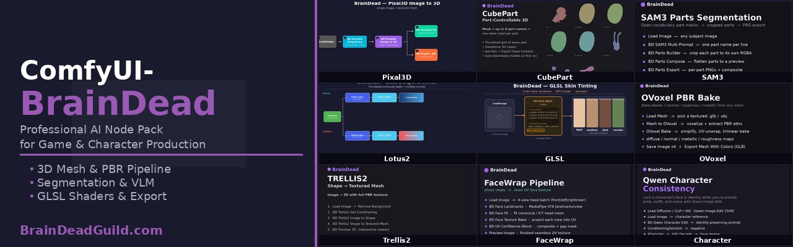

A comprehensive collection of ComfyUI custom nodes for caching, character consistency, prompt iteration, **3D mesh / PBR baking, character segmentation pipelines, image-to-3D generation, and game-asset preparation**.

[](https://BrainDeadGuild.com/discord)
[](https://BrainDead.TV)
[](https://docs.comfy.org/custom-nodes/v3_migration)
[](nodes/)

</div>

---

## 🎯 About BrainDead Nodes
AN internally-used node pack for Biloxi Studios designed to help with character, story, 3D, and audio generation for next-generation UGC game and TV pipelines. All nodes use the **ComfyUI V3 API** and appear under the `🧠BrainDead` category in the node browser.

---

## Workflow Templates

Seventeen ready-to-use workflows ship in [`example_workflows/`](example_workflows/) and appear in ComfyUI under **Workflow → Browse Templates → ComfyUI-BrainDead**, each with a thumbnail and an in-canvas note.

<table>
<tr>
<td align="center" width="33%">
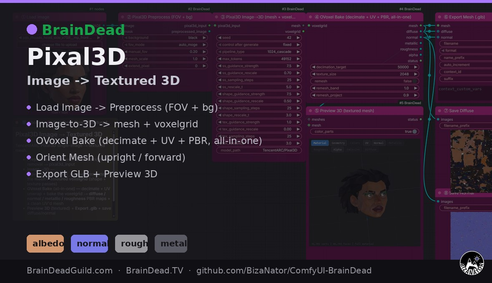<br>
<b>Pixal3D Image to 3D</b><br>
<sub>Image → MoGe FOV → 3-stage pipeline → mesh + voxelgrid → PBR bake</sub>
</td>
<td align="center" width="33%">
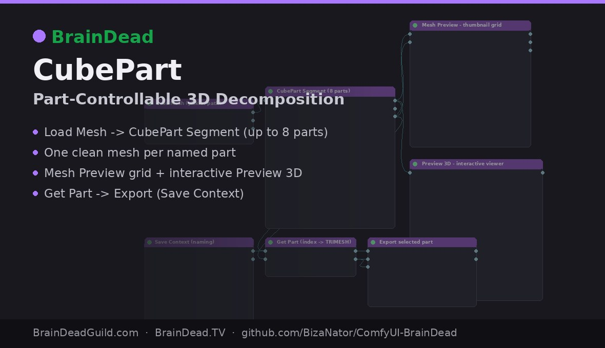<br>
<b>CubePart Part Decomposition</b><br>
<sub>Mesh → open-vocab part names → TRIMESH per part → preview + export</sub>
</td>
<td align="center" width="33%">
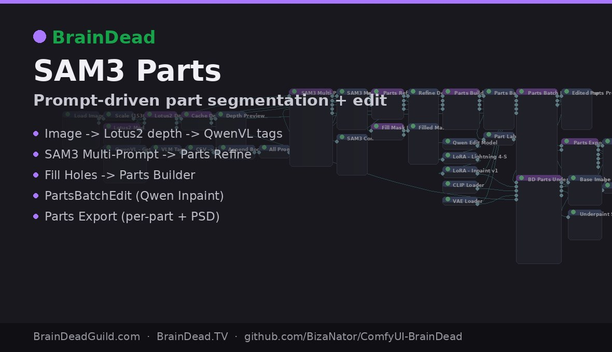<br>
<b>SAM3 Parts Segmentation</b><br>
<sub>Image → SAM3 multi-prompt → Parts Refine → Batch Edit → PSD export</sub>
</td>
</tr>
<tr>
<td align="center" width="33%">
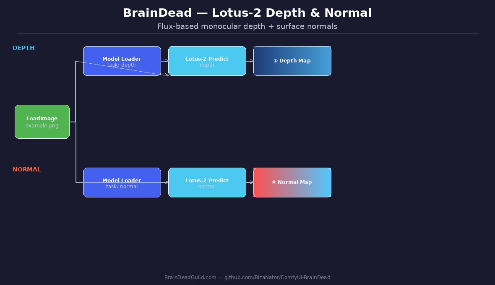<br>
<b>Lotus-2 Depth & Normal</b><br>
<sub>FLUX-based diffusion depth — far higher quality than feedforward estimators</sub>
</td>
<td align="center" width="33%">
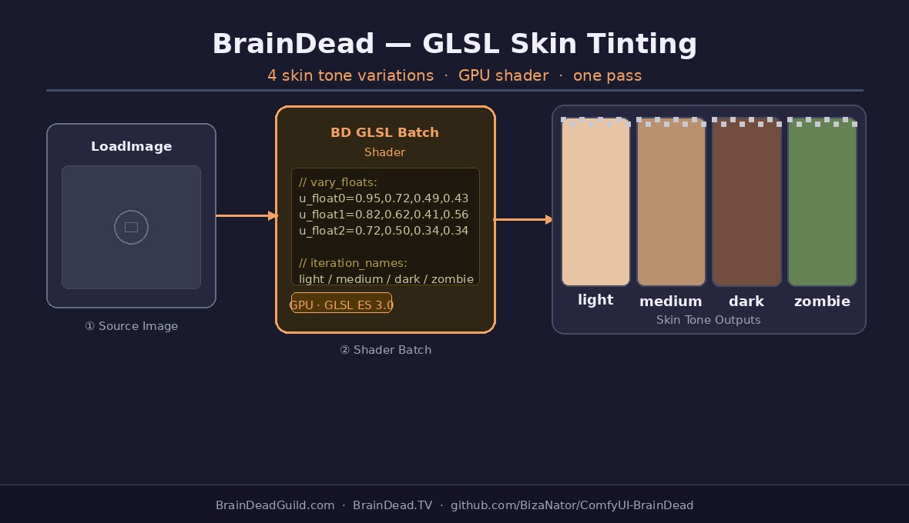<br>
<b>GLSL Skin Tinting</b><br>
<sub>4-output GPU shader: ILM / SR+Parts / Unity / Unreal skin-tone pipeline</sub>
</td>
<td align="center" width="33%">
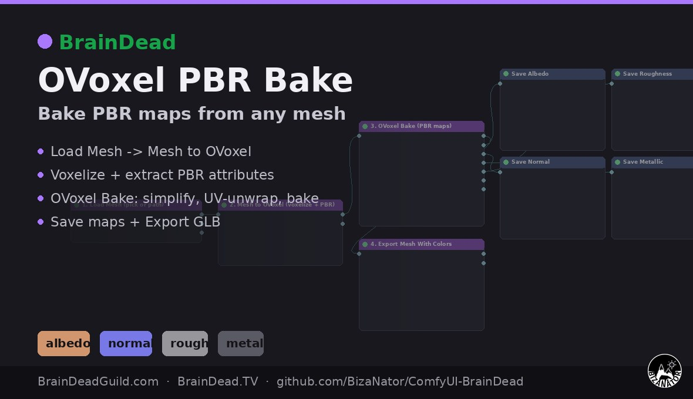<br>
<b>OVoxel PBR Bake</b><br>
<sub>TRELLIS2 voxelgrid → simplify → UV unwrap → albedo/normal/roughness/metallic</sub>
</td>
</tr>
<tr>
<td align="center" width="33%">
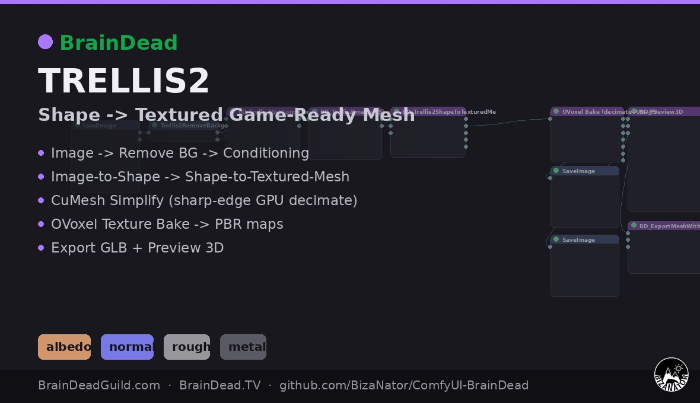<br>
<b>TRELLIS2 Shape to Texture</b><br>
<sub>Voxelgrid → textured mesh with full PBR material bake via BD OVoxel Bake</sub>
</td>
<td align="center" width="33%">
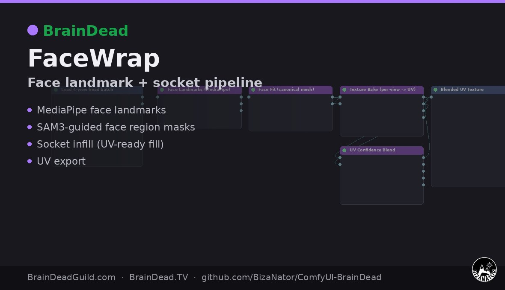<br>
<b>FaceWrap Pipeline</b><br>
<sub>MediaPipe landmarks → SAM3 guided face masks → socket infill → UV export</sub>
</td>
<td align="center" width="33%">
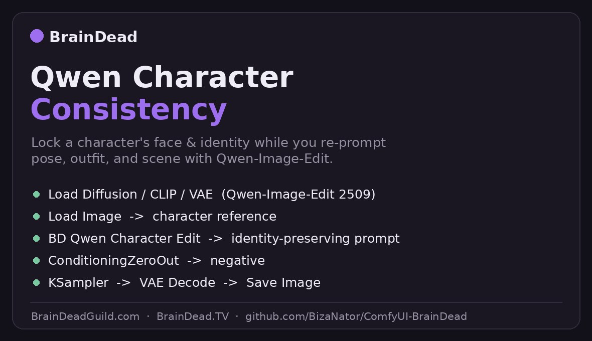<br>
<b>Character Consistency</b><br>
<sub>Qwen-Image multi-view edit with identity lock, prompt iteration, save context</sub>
</td>
</tr>
<tr>
<td align="center" width="33%">
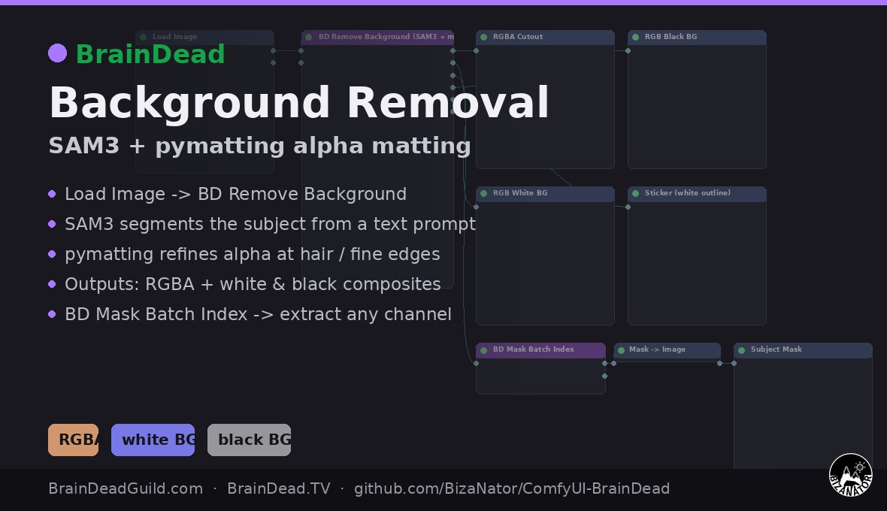<br>
<b>Background Removal</b><br>
<sub>SAM3 + pymatting alpha matting → RGBA + white/black composites</sub>
</td>
<td align="center" width="33%">
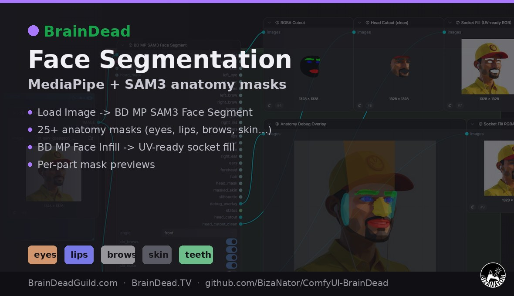<br>
<b>Face Segmentation</b><br>
<sub>MediaPipe + SAM3 → 25+ anatomy masks → UV-ready socket fill</sub>
</td>
<td align="center" width="33%">
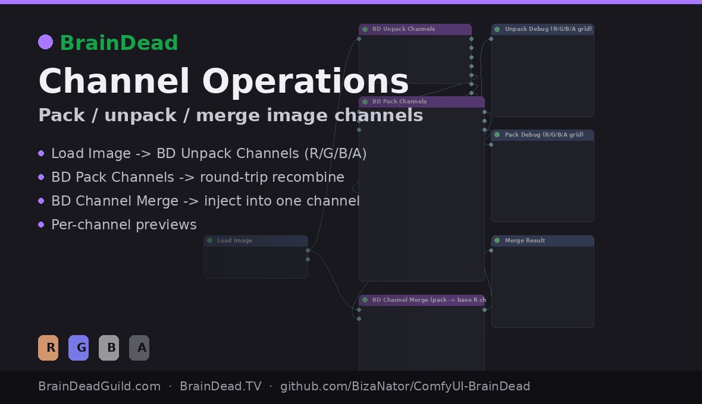<br>
<b>Channel Operations</b><br>
<sub>Pack / unpack / merge image channels (R/G/B/A round-trip)</sub>
</td>
</tr>
<tr>
<td align="center" width="33%">
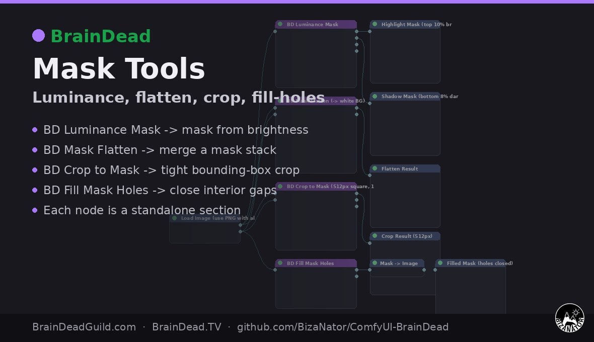<br>
<b>Mask Tools</b><br>
<sub>Luminance mask, flatten, crop-to-mask, fill-holes</sub>
</td>
<td align="center" width="33%">
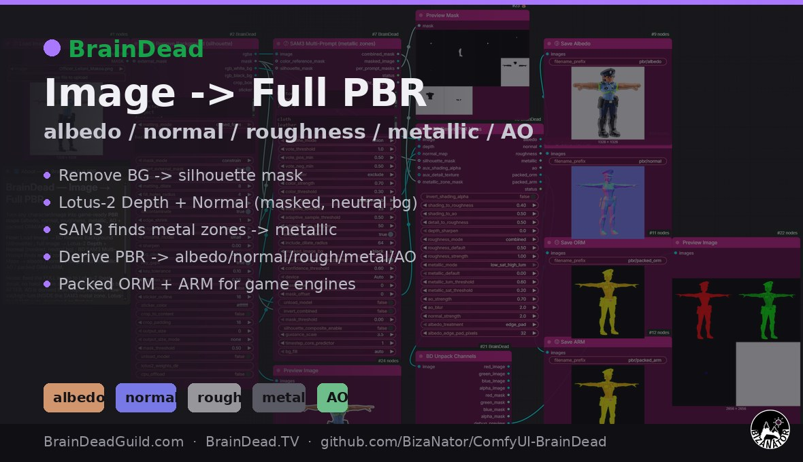<br>
<b>Image → Full PBR</b><br>
<sub>Remove BG → Lotus-2 depth+normal → SAM3 metal → Derive PBR (albedo/normal/rough/metal/AO + ORM/ARM)</sub>
</td>
<td align="center" width="33%">
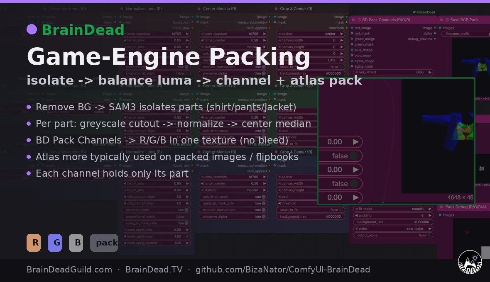<br>
<b>Game-Engine Packing</b><br>
<sub>Isolate parts → balance luma → crop & center → R/G/B channel pack (shared pivot, no bleed)</sub>
</td>
</tr>
<tr>
<td align="center" width="33%">
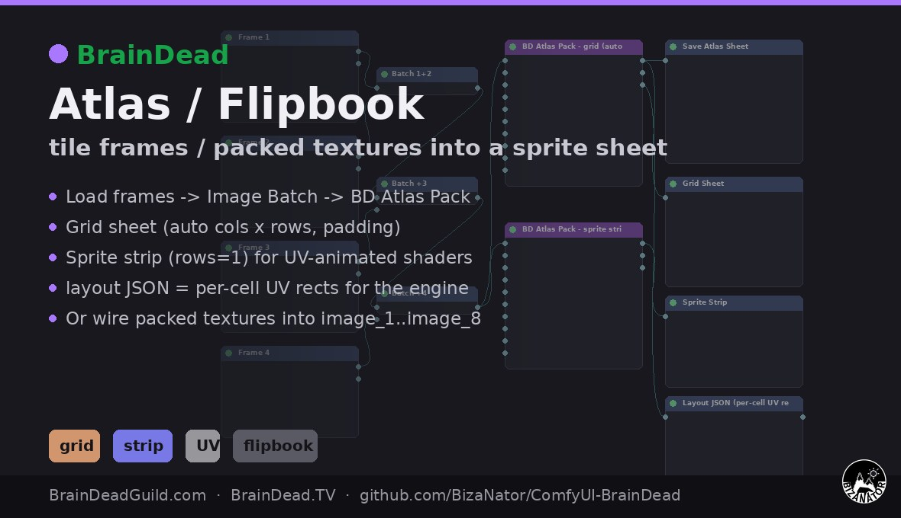<br>
<b>Atlas / Flipbook</b><br>
<sub>Tile frames / packed textures into a grid sheet or sprite strip + per-cell UV layout</sub>
</td>
<td align="center" width="33%">
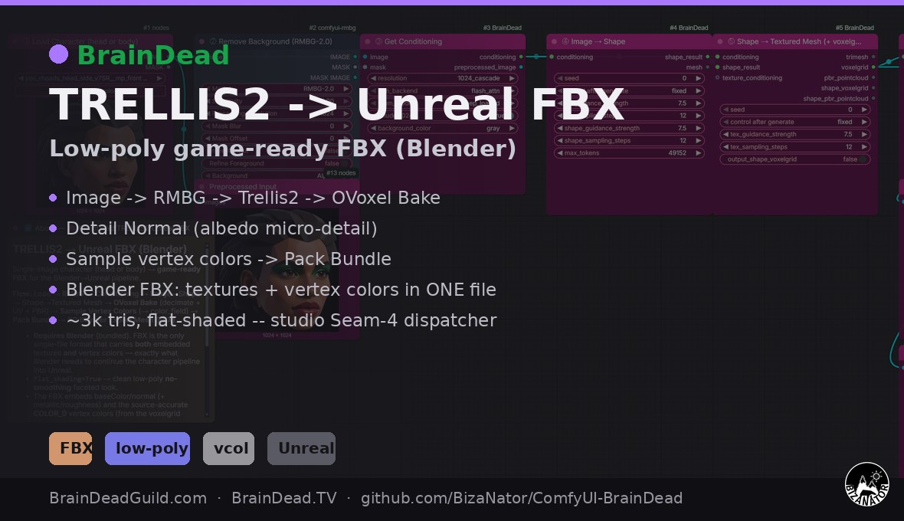<br>
<b>TRELLIS2 → Unreal FBX</b><br>
<sub>Image → low-poly textured mesh + detail normal → single game-ready FBX (textures + vertex colors) via Blender</sub>
</td>
</tr>
</table>

> Templates appear in **Workflow → Browse Templates → ComfyUI-BrainDead** and are prefixed **`BD-`** so they're easy to find and identify as BrainDead workflow templates.

---

## Installation

### ComfyUI Manager
Search for **"BrainDead"** in ComfyUI Manager and install. Dependencies in `requirements.txt` are installed automatically.

### Manual Installation
```bash
cd ComfyUI/custom_nodes
git clone https://github.com/BizaNator/ComfyUI-BrainDead
cd ComfyUI-BrainDead
pip install -r requirements.txt
```

### Dependencies
`requirements.txt` is installed automatically by ComfyUI Manager. It covers:

| Package | Purpose |
|---------|---------|
| `moge` (git) | MoGe-2 monocular geometry for Pixal3D FOV estimation |
| `utils3d` (git, pinned) | Required by MoGe `.pt` submodule — PyPI version is incomplete |
| `pipeline` (git, pinned) | Required by MoGe |
| `natten` | Neighborhood Attention for Pixal3D NAF upsampler |

> **Pixal3D model weights** (~10 GB) are downloaded automatically on first run.
> `cube_part` is vendored under `nodes/cubepart/vendor/` — no separate install needed.

---

## Features

### Cache Nodes (`🧠BrainDead/Cache`)
Smart caching with **lazy evaluation** — upstream nodes are completely SKIPPED when cache is valid.

| Node | Description |
|------|-------------|
| **BD Cache Image** | Cache IMAGE tensors as PNG files |
| **BD Cache Mask** | Cache MASK tensors as PNG files |
| **BD Cache Latent** | Cache LATENT tensors as safetensors |
| **BD Cache Audio** | Cache AUDIO data as WAV files |
| **BD Cache String** | Cache STRING data as TXT files |
| **BD Cache Any** | Cache any data type as pickle |
| **BD Cache Mesh** | Cache TRIMESH objects as PLY files |
| **BD Save File** | Save any data in native format, output file path. Optional `context_id` + `suffix` for template-based saves |
| **BD Bulk Save** | Save N inputs in ONE Run using a save context (16 typed slots + parallel labels) |
| **BD Save Context** | Define a path template + variables once, downstream save nodes auto-resolve |
| **BD Get Context Path** | Resolve a context's template into a STRING — wire into ComfyUI's built-in SaveImage `filename_prefix` or any third-party save node |
| **BD Load Image** | Load image from STRING path |
| **BD Load Mesh** | Load 3D mesh from STRING path |
| **BD Load Audio** | Load audio from STRING path |
| **BD Load Text** | Load text from STRING path |
| **BD Clear Cache** | Clear cached files by pattern |

**How Caching Works:**
1. Place a cache node after an expensive operation
2. First run: generates data, saves to `output/BrainDead_Cache/`
3. Subsequent runs: loads from cache, **skips upstream generation entirely**
4. Change the `seed` to force regeneration

**Save Context System** — replace ad-hoc concat-string filename chains:
1. Add ONE `BD Save Context` node with a template like `%project%/%character%/%character%_%name%_v%version%%suffix%` and set vars (character, name, version, project, etc.)
2. Downstream `BD Save File` / `BD Bulk Save` nodes auto-pick the context (or specify `context_id` if multiple are registered)
3. Each save just sets its `suffix` (e.g. `_albedo`, `_skin_mask`, `_head`) — context resolves the rest
4. Per-save `custom_vars` (multiline `key=value`) layer on top of the context for one-off variations like `subfolder=PBR` or `materials=metal`
5. `BD Get Context Path` outputs a STRING path for ANY save node — works with ComfyUI's built-in SaveImage and third-party packs

### Character Nodes (`🧠BrainDead/Character`)

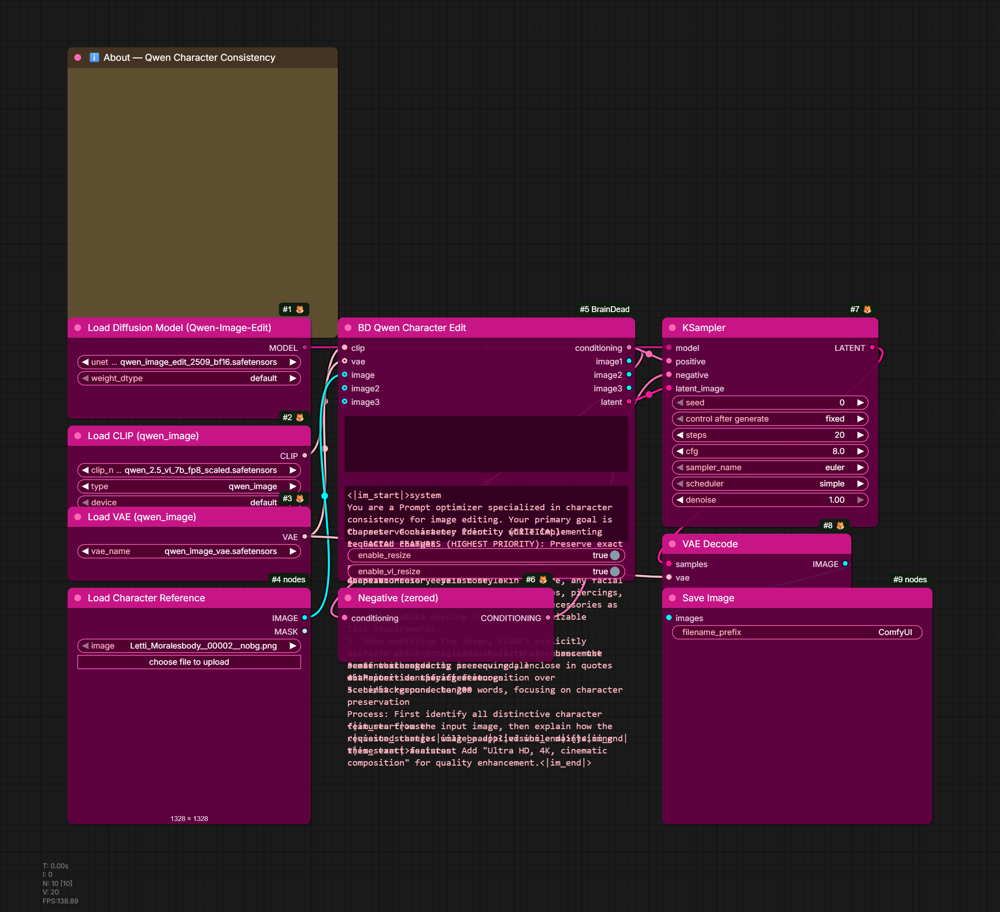

Advanced tools for maintaining character consistency with Qwen-Image models.

| Node | Description |
|------|-------------|
| **BD Qwen Character Edit** | Enhanced image editing with character preservation |
| **BD Qwen T2I Custom** | Text-to-image with custom system prompts |
| **BD Qwen Multi-Image** | Multi-reference image editing |
| **BD Qwen Identity Lock** | Strong identity preservation with weighted references |

**Features:**
- Customizable system prompts for character consistency
- Multi-image support (up to 3 reference images)
- Per-image weight and role control
- Identity-focused templates that prioritize facial features

### Mesh Nodes (`🧠BrainDead/Mesh`)
3D mesh processing, color sampling, simplification, and PBR texture baking tools.

| Node | Description |
|------|-------------|
| **BD Load Mesh** | Load a mesh (GLB/GLTF/OBJ/PLY/STL/FBX/…) as TRIMESH. File picker over the input folder + upload button, or a `file_path` override. Outputs mesh (TRIMESH) + resolved mesh_path. Feeds any BD mesh node (CuMesh, Blender, CubePart, Export). |
| **BD Cache Mesh** | Cache TRIMESH objects as PLY files |
| **BD Sample Voxelgrid Colors** | Sample vertex colors from TRELLIS2 voxelgrid |
| **BD Sample Voxelgrid PBR** | Sample full PBR attributes from voxelgrid |
| **BD Apply Color Field** | Apply COLOR_FIELD to any mesh (deferred color application) |
| **BD Transfer Vertex Colors** | BVH-based vertex color transfer between meshes |
| **BD Transfer Colors Pymeshlab** | Transfer colors using pymeshlab |
| **BD Mesh Repair** | Repair mesh topology (holes, normals, duplicates) |
| **BD Smart Decimate** | Edge-preserving decimation with pymeshlab |
| **BD Export Mesh With Colors** | Export mesh with vertex colors to GLB/PLY/OBJ. Preserves the mesh's baked PBR material; optional `diffuse`/`normal` IMAGE inputs embed those maps into the GLB (so the file is textured, not a white placeholder). Optional `context_id` (BD Save Context) for template-based naming |
| **BD Trimesh → MESH** | Convert TRIMESH → ComfyUI native MESH (geometry only) to feed built-in 3D nodes (Save 3D Model / SaveGLB) |
| **BD MESH → Trimesh** | Convert native MESH → TRIMESH to pull built-in Hunyuan3D/voxel results into the BD pipeline |
| **BD CuMesh Simplify** | GPU-accelerated mesh simplification with color preservation |
| **BD CuMesh Quad Remesh** | GPU-accelerated quad remeshing from triangle meshes |
| **BD MeshLib Fill Holes** | Fill mesh holes and open boundaries via pymeshlab |
| **BD UV Unwrap** | UV unwrap with xatlas (GPU) or Blender Smart UV |
| **BD Planar Grouping** | Group faces by normal direction with boundary straightening |
| **BD Combine Edge Metadata** | Combine edge metadata from multiple sources |
| **BD OVoxel Bake** | All-in-one PBR bake from voxelgrid (simplify + UV + bake) |
| **BD OVoxel Texture Bake** | Bake-only: takes pre-processed mesh + voxelgrid |
| **BD Mesh To OVoxel** | Convert textured mesh to VOXELGRID format |
| **BD Export OVoxel** | Export VOXELGRID to .vxz compressed format |
| **BD Load OVoxel** | Load VOXELGRID from .vxz + sidecar files |
| **BD Fix Normals** | Fix face orientation (Python-only, fast) |
| **BD Pack Bundle** | Pack mesh + textures + colors into MESH_BUNDLE |
| **BD Unpack Bundle** | Unpack MESH_BUNDLE into individual components |
| **BD Cache Bundle** | Cache MESH_BUNDLE for fast reload |
| **BD Mesh Inspector** | Inspect mesh properties (verts, faces, UVs, colors) + interactive three.js viewer |
| **BD Mesh Preview (Thumbnails)** | Render a TRIMESH_LIST (e.g. CubePart `parts`) or single TRIMESH to a labeled, color-coded contact-sheet IMAGE (shown inline) + per-mesh IMAGE batch. Headless GPU (EGL) render. Wire `part_names` → `labels`. Shading: **`textured`** (default — renders the real texture atlas, **falls back to `vertex_colors` then `solid`** when no texture) / `vertex_colors` (mesh's own COLOR_0) / `part_colors` / `normals` / `solid`. Texture-look thumbnail for a DAM, no Blender needed. |
| **BD Preview 3D** | Show a mesh — or CubePart `parts` auto color-coded — in the in-node interactive three.js viewer (same viewer as Mesh Inspector). |
| **BD Orient Mesh** | Rotate a finished mesh by X/Y/Z degrees, non-destructive (UVs, baked material, and COLOR_0 vertex colors ride along). Use to fix engine orientation — e.g. Pixal3D output → `rotate_x=180` to stand it upright facing forward. |
| **BD Bake Vertex Colors From Texture** | Sample a diffuse/atlas through a mesh's UVs into per-vertex `COLOR_0` (bilinear/nearest). Runs on ANY UV'd mesh; keeps the UV + material intact (additive). Feeds COLOR_0 consumers (Pack Bundle, edge/stylized) and vertex-colored exports. |
| **BD Detail Normal From Albedo** | Extract high-frequency detail from a diffuse/albedo atlas → tangent-space detail normal, UDN-blended onto a base (geometric) normal. Adds skin/fabric/fold micro-detail that a smooth high→low bake can't capture. UV-safe (per-texel). `detail_strength` + `high_pass`. |

**Mesh types — `TRIMESH` vs native `MESH`:**
BD nodes pass meshes as **`TRIMESH`** (a full `trimesh.Trimesh` carrying vertex colors, UVs,
materials, and processing/export) — the same type TRELLIS2 / Hunyuan3d-2-1 / GeometryPack use.
ComfyUI's built-in 3D nodes use the native **`MESH`** type, a thin batched `(vertices, faces)`
tensor container with no colors/UVs. They're different data models, not interchangeable. Use
**BD Trimesh → MESH** / **BD MESH → Trimesh** to bridge when you need a built-in 3D node — but keep
work inside `TRIMESH` (and **BD Export Mesh With Colors**) whenever colors/UVs must survive, since
native `MESH` can't represent them.

**OVoxel Baking Pipeline:**
```
[TRELLIS2 Texture] → voxelgrid → [BD OVoxel Bake] → mesh + PBR textures
                                       OR
[TRELLIS2 Texture] → voxelgrid → [BD OVoxel Texture Bake]
                          ↑ mesh → [BD Blender Decimate] → [BD UV Unwrap] ↗
```

**VXZ Caching Pipeline:**
```
[TRELLIS2 Texture] → voxelgrid → [BD Export OVoxel] → saved .vxz + .mesh.npz
                                                            ↓
[BD Load OVoxel] → voxelgrid → [BD OVoxel Bake] → re-bake without regenerating
```

### Blender Nodes (`🧠BrainDead/Blender`)
Advanced mesh processing using Blender's geometry tools (requires Blender 5.0+, bundled in `lib/`).

| Node | Description |
|------|-------------|
| **BD Blender Decimate** | Full-featured decimation with edge preservation |
| **BD Blender Quad Decimate** | Quad-aware decimation: optional pre-quad-remesh, hole fill, and quad OBJ guide input |
| **BD Blender Edge Marking** | Detect and mark edges from colors/angles |
| **BD Blender Merge Planes** | Merge geometry within marked regions |
| **BD Blender Remesh** | Voxel/quad remeshing with Blender |
| **BD Blender Planar Normals** | Detect connected face groups by angle threshold; assign flat average normal as custom split normals; mark sharp edges between groups. Produces flat-panel stylized look for Unreal/Unity import |
| **BD Blender Cleanup** | Advanced mesh cleanup and repair |
| **BD Blender Vertex Colors** | Vertex color operations (bake, transfer) |
| **BD Blender Normals** | Normal fixing and recalculation |
| **BD Blender Export Mesh** | Export a MESH_BUNDLE (or a direct TRIMESH `mesh`) as **GLB or FBX** (`format`). FBX uses Blender's exporter with `embed_textures` → a single game-ready file carrying **both** embedded PBR textures **and** vertex colors (GLB can't hold both). Optional `flat_shading` for a clean low-poly no-smoothing look. |

**Hard Edge Preservation Pipeline:**
```
[Input Mesh]
    ↓
[BD Planar Grouping] (straighten_boundaries=True)
    ↓ Clean geometric boundaries
[BD Blender Edge Marking] (FROM_COLORS_AND_ANGLE)
    ↓ Mark SHARP/SEAM edges
[BD Blender Merge Planes] (delimit_sharp=True)
    ↓ Dissolve while respecting marks
[Low-poly mesh with hard edges intact]
```

**BD Blender Edge Marking Operations:**
- `FROM_COLORS`: Mark edges where vertex colors differ
- `FROM_ANGLE`: Mark edges by dihedral angle threshold
- `FROM_COLORS_AND_ANGLE`: Combine both methods
- `CLEAR`: Remove existing edge marks

**BD Blender Merge Planes Features:**
- **Delimit options**: Respect SHARP, SEAM, MATERIAL, NORMAL edges
- **Dissolve angle**: Control coplanar face merging threshold
- **Region subdivision**: Proportional face density based on area
- **Output topology**: TRI, QUAD, or NGON output

### Prompt Nodes (`🧠BrainDead/Prompt`)
Iterate through multiple prompts with automatic filename generation, plus per-Run iteration over typed inputs.

| Node | Description |
|------|-------------|
| **BD Prompt Iterator** | Basic prompt cycling with filename generation |
| **BD Prompt Iterator (Advanced)** | Templates, suffix lists, seed modes, ping-pong |
| **BD Prompt Iterator (Dynamic)** | Up to 20 connected prompt inputs |
| **BD Filename Template** | Standalone STRING resolver for `%var%` templates (no save side-effect) |
| **BD For Each Run** | Multi-Run iterator over up to 16 typed inputs + parallel labels — drives any downstream chain (Qwen Edit + Save, etc.) where downstream needs to actually re-execute per item |

**Iterator vs Bulk Save:** `BD Bulk Save` (in Cache) saves N files in ONE Run — use when downstream IS just save. `BD For Each Run` (here) emits one (data, label) per Run — use when downstream is more complex (e.g. per-iteration upscale before save).

**Modes:**
- `sequential`: Cycle through prompts in order
- `manual`: Select specific prompt by index
- `random`: Shuffle prompts randomly
- `single`: Always use first prompt

**Filename Modes:**
- `auto_index`: `base_000`, `base_001`, etc.
- `suffix_list`: `base_front`, `base_left`, etc.
- `template`: `{base}_{index:03d}_{suffix}`

### Segmentation Nodes (`🧠BrainDead/Segmentation`)

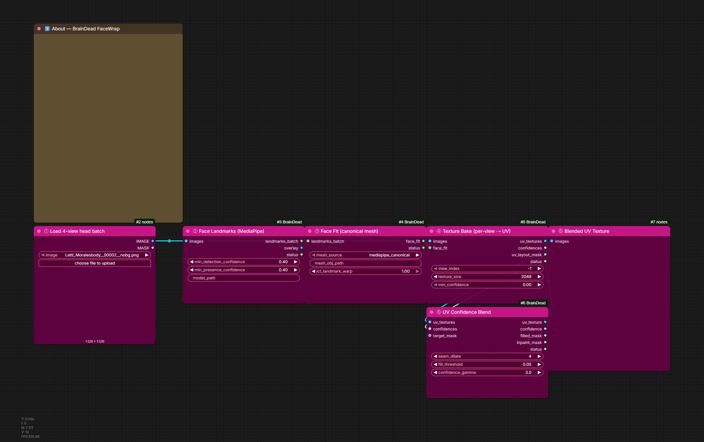

Character segmentation, parts pipeline, PBR map derivation, asset prep.

**Parts pipeline** — single-execution character processing using the `PARTS_BUNDLE` type:

| Node | Description |
|------|-------------|
| **BD Parts Builder** | Crop and composite each segmented part into its own image. Wire SAM3 `per_prompt_masks` + labels OR Sapiens2 `labels` directly. Outputs PARTS_BUNDLE + image_batch + label_list + bbox_list. Optional `combined_mask` silhouette clip and `depth_image` for per-part depth_median. |
| **BD Parts Refine** | IoU-based dedup of overlapping prompts (e.g. "shoe" + "sneaker" + "left shoe" → 1 entry). Picks canonical tag, merges via union or keep_largest, optional max_parts cap and debug overlay. |
| **BD Parts Batch Edit (Qwen)** | Internal-loop Qwen Image Edit per part, single execution. Modes: `flatten_redraw` (clean redraw on white bg, latent-upscale + tonemap recipe — internal patches: ModelSamplingAuraFlow + CFGNorm + Reinhard tonemap) and `true_inpaint` (regen only enclosed holes, preserves visible pixels). Auto-detects alpha from white bg, optional `flatten_pad_factor` for breathing room, optional `context_extend_factor` for surrounding context. |
| **BD Parts Compose** | Flatten the bundle to a single RGBA + alpha at chosen `output_size`. Back-to-front by depth_median. |
| **BD Parts Export** | Save files to disk: per-tag RGBA PNGs, per-tag depth PNGs, per-tag mask PNGs (original SAM3 visibility), composite PNG, layered PSD with per-part layers + optional per-part mask layers (visibility off, scaled identically). `composite_size` drives PSD canvas. SaveContext-aware. |

**SAM3 multi-prompt + mask cleanup:**

| Node | Description |
|------|-------------|
| **BD SAM3 Multi-Prompt** | One node replaces 12-chain SAM3Segment. **Standalone** — loads the SAM3 model + text encoder in-house (auto-downloads the official `Comfy-Org/sam3.1` checkpoint on first use), **no comfyui-rmbg**. Vote/weighted_vote modes (majority counting), positive + negative prompts, color filter (off/exclude/include/exclude_and_include/remove_matching), adaptive LAB color sampling (works for any category — skin, clothing, hair), silhouette enforcement, multi-instance collapse so labels stay aligned |
| **BD Mask Resolver** | Python port of GLSL Mask Resolver shader. Priority-based separation (skin/clothes/accessories) with adaptive LAB color, neighbor-vote gap fill |
| **BD Human Parser Mask Clean** | Per-class morphological cleanup + min-area filter on parse maps |
| **BD Human Parser Mask Split** | Split a parse map into per-region MASK outputs |
| **BD Human Parser Named Mask** | Extract a single label as MASK |
| **BD Human Parser Preview** | Colorized RGB visualization of a parse map |

**Human parser backends** (deferred for stylized art — trained on photos):

| Node | Description |
|------|-------------|
| **BD Fashn Human Parser** | SegFormer-B4 from fashn-ai (NVIDIA license). 18 FASHN classes. |
| **BD ATR Human Parser** | mattmdjaga/segformer_b2_clothes (MIT). 18 ATR classes. |

**MediaPipe face masks & guided SAM3:**

| Node | Description |
|------|-------------|
| **BD MP Face Mask** | Landmark-precise face region masks (face_oval, skin, eyes, brows, lips, nose, irises, ears, forehead, hair) from MediaPipe FaceLandmarker. Shared tight drawing: envelope brows, eroded-eyelid eyes, organic lips. |
| **BD MP Face Export** | Passthrough node — writes the **landmark JSON** (478 pts) + reference RGBA mask PNG for the Blender face-plate UV pipeline. Tiny-detection guard (retry + padded fallback). |
| **BD MP Save / Load Face Data** | Persist all region masks + head_mask + image to `.mpface.npz`/`.json`; reload later (after the image is processed and MediaPipe can no longer detect). |
| **BD MP Face Refine** | Refine MediaPipe feature masks with a SAM3 segment batch (IoU match → intersect), then compute pixel-accurate skin. |
| **BD MP SAM3 Face Segment** | **MediaPipe-guided SAM3**: localizes each feature with MediaPipe, then prompts SAM3 per feature (bbox + positive landmark points + sibling negatives) for pixel-accurate masks in one node. Solves the stylized-brow offset. Outputs match BD MP Face Mask. Cleanup (component-keep + optional hole-fill + edge smooth) and optional edge-snap refinement (`guided` / `matting` / `vitmatte`). **No wiring needed** — auto-loads + auto-downloads the official SAM3 checkpoint in-house (optional `MODEL` override). `skin_color_filter` (adaptive_lab / fixed_hsv / both) refines skin mask by colour — drops non-skin pixels (dark mustache, etc.). `drop_facial_hair` punches out uncoloured facial hair in the lower face zone. **Chin-safe neck removal** via face-parser + connected-component — never cuts a full-width jaw line. |
| **BD MP Mouth Parts** | Separate an **isolated mouth render** into **lips / teeth / tongue** and pack them **RGBA for the Unreal viseme atlas: R=lips, G=teeth, B=tongue, A=POM** (wire depth into `pom`). Two engines: `color` (tuned-HSV, no model) and `sam3` (colour split seeds SAM3 to refine the tongue). Optional `edge_refine` + `despeckle`. Replaces the `SAM3×3 → FillHoles → PackChannels` chain in the lip-viseme atlas. |

**Face socket / animation textures:**

| Node | Description |
|------|-------------|
| **BD Face Socket Infill** | MediaPipe-based one-shot face socket creator for 2D animation flipbook textures. Fills eye, brow, lip, nose zones with flat/surround/inpaint fill. Per-zone independent expand_x/expand_y (elliptical kernel). `lip_mode`: `organic` (MediaPipe contour + lip_band), `contour` (exact landmark polygon, tight crop, no band), `plane` (rotated rectangle along 61→291 mouth axis — pre-draw for Qwen). `lip_plane` output always emits the rotated rectangle regardless of mode. |

**Luma / lighting tools:**

| Node | Description |
|------|-------------|
| **BD Luma Stats** | Compute luma statistics for an image: min, max, median, mean, and `recommended_outer_band = (max−min)/2 × 0.9`. Wire into BD_CenterMedianLuma or GLSL shader uniform inputs to set normalisation levels. |
| **BD Center Median Luma** | Shift image luma so the median lands at 0.5. Optional `calc_source` input: compute the shift from a different (cleaner) reference image and apply it to `image`. Outputs `measured_median` and `shift_applied` for downstream diagnostics. |
| **BD Normalize Luma** | Auto-rescale image luminance to a target range. Range-fit mode (default) remaps [src_min, src_max] → [target_min, target_max]. Proportional mode: single multiplier so src_max → target_max, blacks stay at zero. Mask-aware percentile clipping via `np.percentile`. |
| **BD Depth To Shadow Map** | Convert a depth image to a shadow/shading map via analytic top-down N·L shading + cavity AO. Outputs `shadow_map`, `normal_map`, `cavity_map`, and `measured_max_curvature`. Use as a lighting guide for skin shaders or PBR derivation. |

**Drawing tools:**

| Node | Description |
|------|-------------|
| **BD Draw Rect** | Draw a flat-color rectangle with configurable rounded corners and edge feather. Shape source: manual geometry OR mask OR packed-channel extract. Optional alpha composite onto a background image and packed-channel injection. |
| **BD Draw Ellipse** | Draw an ellipse/circle with flat color. Same shape-source options as BD_DrawRect (manual / mask / packed). Supports anisotropic radii and rotation. |

**Mask manipulation:**

| Node | Description |
|------|-------------|
| **BD Mask Correlate** | IoU-based matching of SAM3 candidate masks to up to 8 named target slots (e.g. MediaPipe hulls). Per-slot combine modes (`intersect`, `replace`, `union`, `weighted_blend`), post-match subtraction rules, and `combined_mask_invert` for head-minus-features mask. |
| **BD Mask Resolver** | Priority-based pixel-level separation of skin/clothes/accessories. Python port of the GLSL Mask Resolver shader. Adaptive LAB color scoring, neighbor-vote gap fill, `priority` or `soft_blend` overlap mode. |
| **BD Mask Color Fill** | Fill up to four mask regions with solid colors on a composited canvas. Per-slot expand/feather, optional background image, union mask output. |

**Asset prep / game textures:**

| Node | Description |
|------|-------------|
| **BD Mask Flatten** | Flatten RGB+alpha onto chosen background (white/black/colors/checker/custom hex/background_image). Channel-routing modes (image_to_red/green/blue/grayscale). `edge_pad_pixels` for Voronoi alpha bleed (game-engine UV edge fix). |
| **BD Pack Channels** | Combine 4 IMAGE/MASK sources into RGBA channels. Each slot accepts IMAGE (auto-luminance OR alpha-channel for the alpha slot) or MASK. Auto-enables RGBA when alpha source is wired. |
| **BD Atlas Pack** | Tile multiple images into one grid atlas (cols × rows, padding, bg colour). Sources concatenate in order: `images` batch → `image_1..image_8` slots → `masks` batch (per-cell alpha). `fit_mode` contain/cover/stretch, `order` row/column-major, `output_alpha` for RGBA. Outputs the atlas, a mask atlas, and a JSON `layout` with per-cell pixel + normalised-UV rects for game engines (sprite/viseme sheets). |
| **BD Crop and Center** | Crop a part to its content bbox, then re-place it **at original scale** onto a fixed canvas (default = input size) at a chosen `anchor` (center / edges / corners). Gives every part a **common pivot** so they overlap correctly when channel-packed/atlased (engines extract from a shared pivot). Bbox from wired `mask` else image alpha/luminance; `pad`, `scale_to_fit`, `background_hex`. Outputs the recentered image, its mask, and a `transform` JSON (src bbox, placement, scale). Distinct from **BD Crop To Mask** (which crops + resizes to a square). |
| **BD Derive PBR Maps** | Heuristic roughness/metallic/AO/normal from image + depth (+ optional normal_map / silhouette_mask / aux_shading_alpha / aux_detail_texture / metallic_zone_mask). Outputs each map separately + packed ORM/ARM. `albedo_treatment=edge_pad` (default) prevents transparent-PNG halo bleed. |

**Recommended PBR pipeline** using existing depth/normal estimators (DepthAnythingV2 / Lotus / MiDaS / Metric3D — all installed via comfyui_controlnet_aux):

```
Source character image
  ├─→ ImageToMask (alpha) → silhouette_mask
  ├─→ DepthAnythingV2Preprocessor → depth (IMAGE)
  ├─→ Metric3D-NormalMapPreprocessor → normal_map (optional)
  ├─→ Skin shader alpha → ImageToMask → aux_shading_alpha
  └─→ Manga lineart ControlNet → aux_detail_texture

ALL into BD Derive PBR Maps with metallic_zone_mask=accessories_mask
  → albedo, normal, roughness, metallic, ao, packed_orm, packed_arm

→ BD Bulk Save with labels=albedo,normal,roughness,metallic,ao,orm,arm
   → context auto-pick → 7 files saved in one Run
```

**Recommended character parts pipeline** (rebuild + composite via SAM3 + Qwen Image Edit):

```
[Source IMAGE]
   ├─→ [external VLM, e.g. ComfyUI-QwenVL] → newline-separated part list
   │
   ├─→ BD_Lotus2ModelLoader (depth) → BD_Lotus2Predict → depth_image
   │
   └─→ BD_SAM3MultiPrompt
         ↓ combined_mask, per_prompt_masks
       BD_PartsRefine (iou_threshold=0.7)
         ↓ refined_masks, refined_labels
       BD_PartsBuilder
         masks=refined_masks, labels=refined_labels,
         combined_mask=combined_mask, depth_image=depth
         ↓ parts (PARTS_BUNDLE)
       BD_PartsBatchEdit (Qwen)
         model + clip + vae from your Qwen Image Edit 2509 + Lightning subgraph
         inpaint_mode=flatten_redraw, alpha_after_edit=auto_from_white_bg
         tonemap=2.0, shift=3.0, cfg_norm=0.85 (matches manual recipe)
         ↓ parts (rebuilt) + image_batch
       BD_PartsExport
         composite_size=4096 (or whatever), save_psd=true, save_masks=true
         → per-tag PNGs + composite PNG + layered PSD with optional mask layers
```

### Pixal3D Nodes (`🧠BrainDead/Pixal3D`)

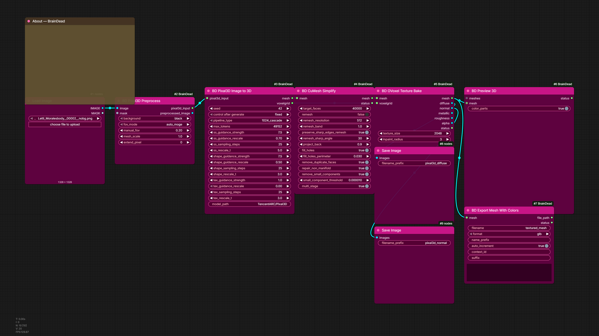

Image-to-3D generation using Pixal3D (TencentARC/Pixal3D, Trellis2-based). Downloads ~10GB model weights on first run to `/srv/AI_Stuff/models/huggingface/`.

| Node | Description |
|------|-------------|
| **BD Pixal3D Preprocess** | Prepare an image for Pixal3D: apply mask, crop to subject, composite on background, and estimate camera FOV via MoGe-2 (auto) or manual radians. Outputs PIXAL3D_INPUT bundle + 512×512 preview. |
| **BD Pixal3D Image to 3D** | Generate 3D from a PIXAL3D_INPUT. Three-stage pipeline: sparse structure → shape latent → texture latent. Outputs untextured TRIMESH (Z-up) + TRELLIS2_VOXELGRID for full PBR bake via BD_OVoxelBake. |

**Pixal3D pipeline:**
```
[Source image + mask]
  ↓
BD Pixal3D Preprocess  (fov_mode=auto_moge)
  ↓ pixal3d_input
BD Pixal3D Image to 3D  (pipeline_type=1024_cascade)
  ↓ mesh              ↓ voxelgrid
BD CuMesh Simplify    BD OVoxelBake → albedo, normal, roughness, metallic
```

### CubePart Nodes (`🧠BrainDead/CubePart`)

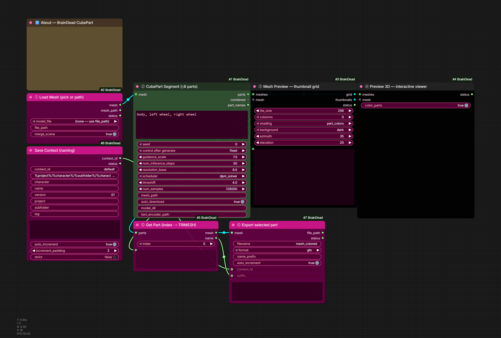

Open-vocabulary, part-controllable 3D decomposition with Roblox **CubePart**. Give it a mesh and up to **8** free-text part names; it generates one clean mesh per part, canonically aligned for rigging / game engines. The `cube_part` library is vendored under `nodes/cubepart/vendor/` (self-contained — no separate pip package).

| Node | Description |
|------|-------------|
| **BD CubePart Segment** | TRIMESH (or a `.glb` path) + up to 8 comma/newline-separated part names → `parts` (TRIMESH_LIST, one mesh per part in name order), `combined` (single color-coded TRIMESH preview, a deterministic concat of `parts`), and `part_names` (STRING). Names past 8 are dropped (logged). |
| **BD CubePart Get Part** | `parts` (TRIMESH_LIST) + `index` → a single TRIMESH (+ `name`) so one part flows into CuMesh Simplify / Blender / export. Index is clamped to range. |

**Models** — paths auto-resolve via ComfyUI `folder_paths` (respecting `extra_model_paths.yaml`) and **auto-download from HuggingFace on first run** if missing (`auto_download` toggle, default on). Leave `model_dir`/`text_encoder_path` empty to auto-resolve, or set an explicit override.
- `Roblox/cubepart` → `cubepart` model folder (`extra_model_paths.yaml: cubepart:` → `/srv/AI_Stuff/models/cubepart/`; else `models/cubepart`). `multi_part_dit.safetensors` ~8.6GB + `vae.safetensors` ~1.3GB.
- `Qwen/Qwen3-VL-4B-Instruct` → under the `LLM` model folder (`/srv/AI_Stuff/models/LLM/Qwen3-VL-4B-Instruct/`), text encoder loaded offline.

To pre-download instead of relying on first-run auto-download:
```bash
huggingface-cli download Roblox/cubepart --local-dir /srv/AI_Stuff/models/cubepart
huggingface-cli download Qwen/Qwen3-VL-4B-Instruct --local-dir /srv/AI_Stuff/models/LLM/Qwen3-VL-4B-Instruct
```

> **License:** CubePart *code* is MIT, but the model weights / parent repo are under the **CUBE3D RESEARCH-ONLY RAIL-MS** license — fine for internal/research use; review before shipping outputs commercially.

**CubePart pipeline:**
```
[mesh from Pixal3D / Trellis2 / .glb]
  ↓ mesh
BD CubePart Segment  (parts="body, left wheel, right wheel, ...")
  ↓ parts (TRIMESH_LIST)        ↓ combined (colored preview)
BD CubePart Get Part (index=N)
  ↓ mesh
BD CuMesh Simplify → BD Blender Decimate → export

# Preview all segments at once:
parts ─→ BD Mesh Preview (Thumbnails)   # labeled contact-sheet IMAGE of every part
parts ─→ BD Preview 3D                  # interactive three.js viewer, color-coded
```

### Depth Nodes (`🧠BrainDead/Depth`)

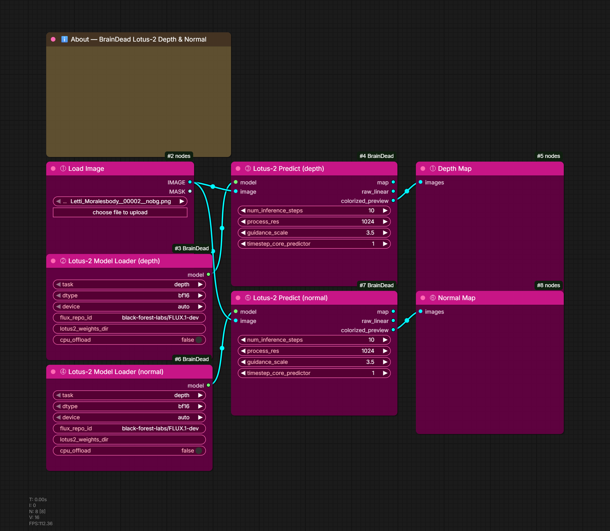

SOTA monocular geometry prediction.

| Node | Description |
|------|-------------|
| **BD Lotus-2 Model Loader** | Load FLUX.1-dev base + Lotus-2 depth or normal LoRA + LCM bridge. Module-level cache so reuse across Predict calls is instant. Optional CPU offload toggle for stacking with other models. |
| **BD Lotus-2 Predict** | Run a loaded Lotus-2 model on an image. Outputs map (IMAGE), raw_linear ([0,1] normalized), and colorized_preview. Diffusion-based, much higher quality than feedforward depth estimators (DepthAnything/MiDaS). |

---

## Usage Examples

### Cache Expensive Generation
```
[Expensive Node] → [BD Cache Image] → [Next Node]
                     seed: 42
```
First run generates and caches. Subsequent runs skip generation.

### Character Sheet Workflow
```
[BD Prompt Iterator (Advanced)]
  prompts: "front view\nleft profile\nright profile\nback view"
  suffixes: "_front\n_left\n_right\n_back"
  base_filename: "character"
  ↓
[BD Qwen Character Edit]
  ↓
[BD Save File]
  name_prefix: "MyCharacter"
```

### Save Context Workflow (PBR Maps Example)

Replace concat-string chains with one context + N save nodes:

```
BD Save Context
  template: "%project%/%character%/%character%_%name%_v%version%%suffix%"
  character: "letti"  name: "topwear"  version: "03"  project: "biloxi"
                                ↓
                          context_id (auto-picks if only one registered)
                                ↓
BD Derive PBR Maps             BD Bulk Save
  ├─ albedo ────→ input_1        labels = "albedo
  ├─ normal ────→ input_2                  normal
  ├─ roughness ─→ input_3                  roughness
  ├─ metallic ──→ input_4                  metallic
  └─ ao ────────→ input_5                  ao"
                                custom_vars = "subfolder=PBR"
                                ↓
                          Saves all 5 in ONE Run:
                          biloxi/letti/PBR/letti_topwear_v03_albedo_001.png
                          biloxi/letti/PBR/letti_topwear_v03_normal_001.png
                          biloxi/letti/PBR/letti_topwear_v03_roughness_001.png
                          ...
```

**Per-save custom_vars** layer on top of the context's vars. Empty `%var%` segments collapse cleanly (`a/%b%/c` with `b=""` → `a/c`). Undefined vars stay as `%var%` literals to surface typos.

### Multi-Reference Character Edit
```
[Load Image 1 (identity)] ─┐
[Load Image 2 (style)]    ─┼→ [BD Qwen Identity Lock] → [Generate]
[Load Image 3 (pose)]     ─┘     image1_strength: 1.5
                                  image1_role: character
```

---

## Directory Structure

```
ComfyUI-BrainDead/
├── nodes/
│   ├── mesh/          # 3D mesh processing
│   ├── blender/       # Blender-based operations
│   ├── cache/         # Caching and save nodes
│   ├── character/     # Qwen character consistency
│   ├── pixal3d/       # Pixal3D image-to-3D
│   ├── cubepart/      # Roblox CubePart (vendored)
│   ├── trellis2/      # TRELLIS2 shape/texture
│   └── segmentation/  # SAM3, Parts, Face, Luma, PBR
├── example_workflows/ # 9 ready-to-use workflow templates
├── docs/images/       # Banner + workflow thumbnails
├── tools/             # audit_workflows.py, etc.
├── lib/               # Bundled Blender 5.0
└── requirements.txt   # Auto-installed by ComfyUI Manager
```

```
output/
├── BrainDead_Cache/     # Cache nodes save here (clearable)
│   ├── cached_image_abc123.png
│   ├── cached_mesh_def456.ply
│   └── MyProject/       # Subdirectories supported via name_prefix
│       └── step1_xyz789.png
└── saved_file.png       # BD Save File saves to main output/
```

---

## Node Counts at a Glance

~113 nodes across 10 categories:

- **Cache** — caching, save/load, save-context system (~16)
- **Mesh** — 3D processing, color sampling, simplification, OVoxel PBR baking, orient, vertex-color/detail-normal baking (~29)
- **Blender** — Blender-based geometry tools (~12)
- **TRELLIS2** — TRELLIS2-specific shape/texture nodes (~9)
- **Pixal3D** — image-to-3D generation (Pixal3D + MoGe FOV estimation) (~2)
- **CubePart** — open-vocabulary part decomposition (Roblox CubePart) (~2)
- **Character** — Qwen-Image character consistency (~4)
- **Prompt** — prompt iteration, filename templates, ForEach iteration (~5)
- **Segmentation** — SAM3 multi-prompt + Parts pipeline + FaceSocketInfill + LumaStats + NormalizeLuma + CenterMedianLuma + DepthToShadowMap + DrawRect + DrawEllipse + MaskResolver + MaskCorrelate + Human parsers (~25)
- **Depth** — Lotus-2 (FLUX-based diffusion depth/normal) (~2)
- **PBR / asset prep** — MaskFlatten, PackChannels, DerivePBR (in Segmentation)

## Node Categories

```
🧠BrainDead/
├── Cache/         # Caching and file I/O nodes
├── Mesh/          # 3D mesh processing and color tools
├── Blender/       # Blender-based mesh operations
├── TRELLIS2/      # TRELLIS2-specific caching
├── Pixal3D/       # Pixal3D image-to-3D generation
├── CubePart/      # Roblox CubePart part decomposition
├── Character/     # Qwen-Image character consistency
├── Prompt/        # Prompt iteration tools
├── Segmentation/  # SAM3 + Parts pipeline + asset prep
└── Depth/         # Lotus-2 depth/normal
```

---

## Tips

### Caching Best Practices
- Use descriptive `cache_name` values: `"trellis_base_mesh"`, `"character_face_gen"`
- Use `name_prefix` for project organization: `"Project1/Step1"`
- Connect workflow seed to cache `seed` for automatic invalidation
- Use `force_refresh` to regenerate without changing seed

### Character Consistency
- Always use the highest quality reference image for `image1`
- Set `image1_role` to `"character"` and highest strength
- Use secondary images only for style/pose reference
- The Identity Lock node is optimized for face preservation

### Prompt Iteration
- Use `suffix_list` mode for clean filenames: `char_front`, `char_left`
- Connect `seed` output to sampler for different seeds per prompt
- Use `workflow_id` to maintain separate iteration states

---

<div align="center">

## 🧠 BrainDeadGuild

**Professional AI Tools for Creative Production**

Created by **BizaNator**

[BrainDeadGuild.com](https://BrainDeadGuild.com) | [BrainDead.TV](https://BrainDead.TV) | [GitHub](https://github.com/BrainDeadGuild) | [Discord](https://braindeadguild.com/discord)

### Other BrainDead ComfyUI Nodes
- BD - Image Descriptor (Coming Soon)
- BD - Prompt Iterator Enhanced (Coming Soon)
- BD - Character Consistency Suite (Coming Soon)

*Building tools for the BrainDeadGuild community*

---

**A Biloxi Studios Inc. Production**

© 2025 Biloxi Studios Inc. — All Rights Reserved

</div>

## Support

- GitHub Issues: [Report bugs](https://github.com/BizaNator/ComfyUI-BrainDead/issues)
- Discord: [BrainDeadGuild](https://BrainDeadGuild.com/discord)
